<a href="https://lagharilabs.com">
  <picture>
    <source media="(prefers-color-scheme: dark)" srcset="assets/hero-dark.svg">
    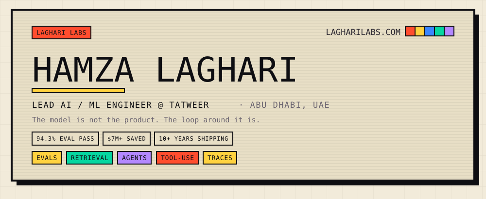
  </picture>
</a>

<div align="center">

<a href="https://lagharilabs.com"><picture><source media="(prefers-color-scheme: dark)" srcset="assets/btn-web-dark.svg"></picture></a> <a href="https://www.linkedin.com/in/mhlaghari"><picture><source media="(prefers-color-scheme: dark)" srcset="assets/btn-linkedin-dark.svg"></picture></a> <a href="mailto:mhlaghari@gmail.com"><picture><source media="(prefers-color-scheme: dark)" srcset="assets/btn-email-dark.svg"></picture></a> <a href="https://lagharilabs.com/#notes"><picture><source media="(prefers-color-scheme: dark)" srcset="assets/btn-notes-dark.svg">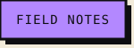</picture></a>

</div>

<picture>
  <source media="(prefers-color-scheme: dark)" srcset="assets/hdr-whoami-dark.svg">
  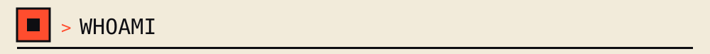
</picture>

```python
class HamzaLaghari:
    role      = "Lead AI / ML Engineer @ Tatweer"
    founding  = "Head of Data & AI · Founding Eng @ Rintel"
    location  = "Abu Dhabi, UAE"
    education = "MS Business Analytics & AI — NYU Stern"
    shipping_since = 2015              # 10+ years ML, ~4 of it agentic

    works_on = [
        "evals — the eval set is the moat",
        "retrieval, RAG, and tool-use graphs",
        "traces, structured output, fallback loops",
        "the policy that decides when a model should stop talking",
    ]

    def manifesto(self):
        return "The model is not the product. The loop around it is."
```

<picture>
  <source media="(prefers-color-scheme: dark)" srcset="assets/hdr-work-dark.svg">
  
</picture>

<picture>
  <source media="(prefers-color-scheme: dark)" srcset="assets/work-adversaria-dark.svg">
  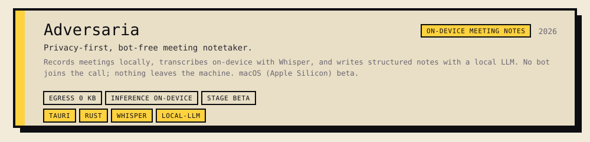
</picture>

<picture>
  <source media="(prefers-color-scheme: dark)" srcset="assets/work-arrival-kit-dark.svg">
  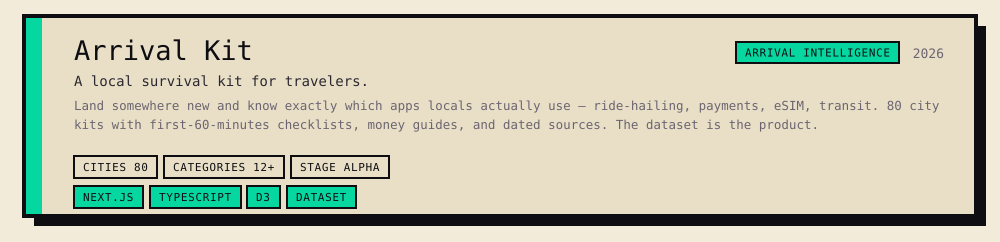
</picture>

<picture>
  <source media="(prefers-color-scheme: dark)" srcset="assets/work-lagharilabs-os-dark.svg">
  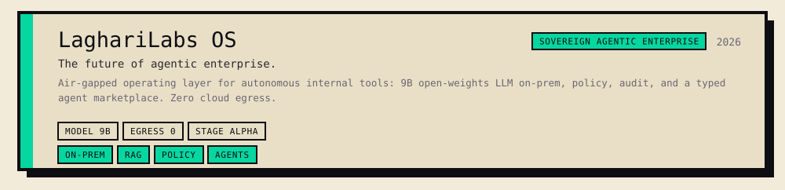
</picture>

<picture>
  <source media="(prefers-color-scheme: dark)" srcset="assets/work-datamind-dark.svg">
  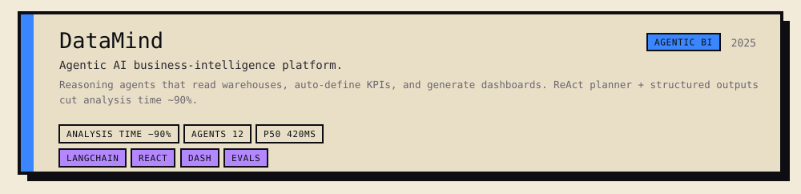
</picture>

<picture>
  <source media="(prefers-color-scheme: dark)" srcset="assets/work-quantallica-dark.svg">
  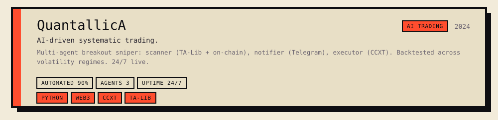
</picture>

<picture>
  <source media="(prefers-color-scheme: dark)" srcset="assets/hdr-quests-dark.svg">
  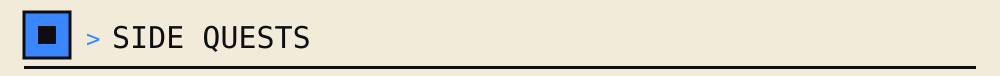
</picture>

<picture>
  <source media="(prefers-color-scheme: dark)" srcset="assets/quests-dark.svg">
  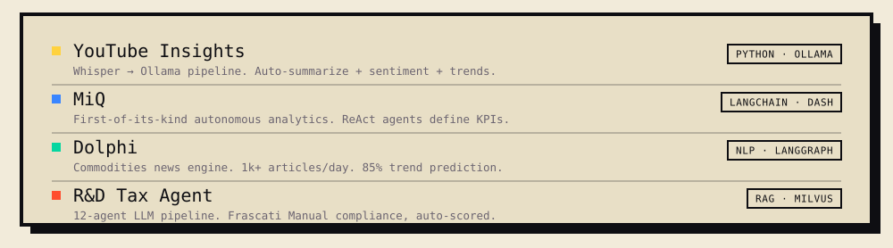
</picture>

<picture>
  <source media="(prefers-color-scheme: dark)" srcset="assets/hdr-stack-dark.svg">
  
</picture>

<picture>
  <source media="(prefers-color-scheme: dark)" srcset="assets/stack-dark.svg">
  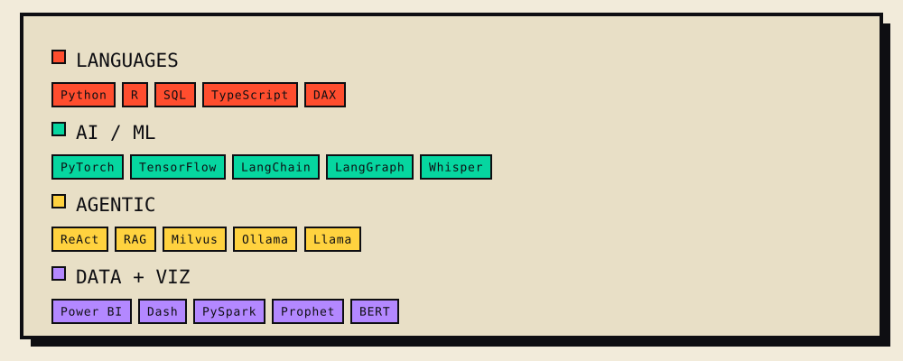
</picture>

<picture>
  <source media="(prefers-color-scheme: dark)" srcset="assets/hdr-stats-dark.svg">
  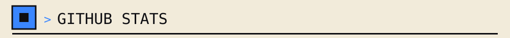
</picture>

<picture>
  <source media="(prefers-color-scheme: dark)" srcset="assets/stats-dark.svg">
  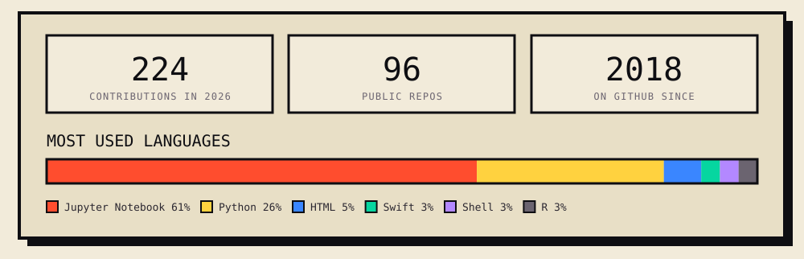
</picture>

<picture>
  <source media="(prefers-color-scheme: dark)" srcset="assets/hdr-career-dark.svg">
  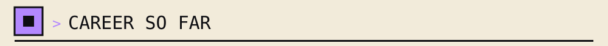
</picture>

<picture>
  <source media="(prefers-color-scheme: dark)" srcset="assets/timeline-dark.svg">
  
</picture>

<picture>
  <source media="(prefers-color-scheme: dark)" srcset="assets/hdr-notes-dark.svg">
  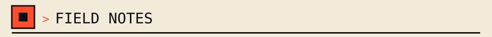
</picture>

<picture>
  <source media="(prefers-color-scheme: dark)" srcset="assets/notes-dark.svg">
  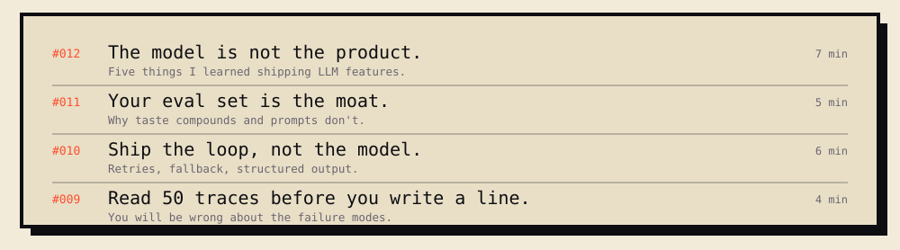
</picture>

<picture>
  <source media="(prefers-color-scheme: dark)" srcset="assets/footer-dark.svg">
  
</picture>

<picture>
  <source media="(prefers-color-scheme: dark)" srcset="assets/quote-dark.svg">
  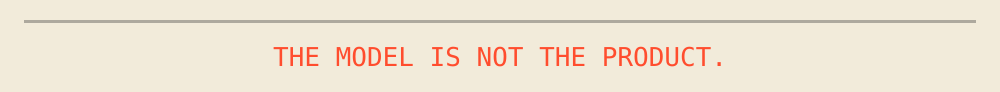
</picture>
